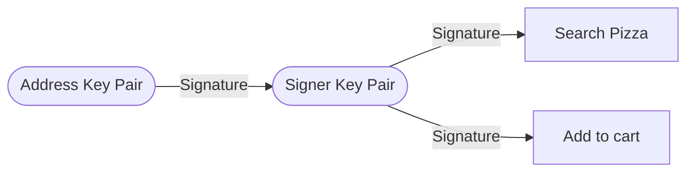
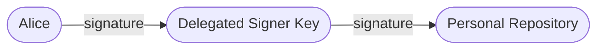
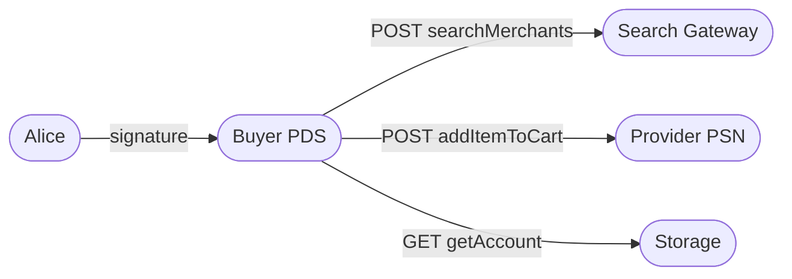
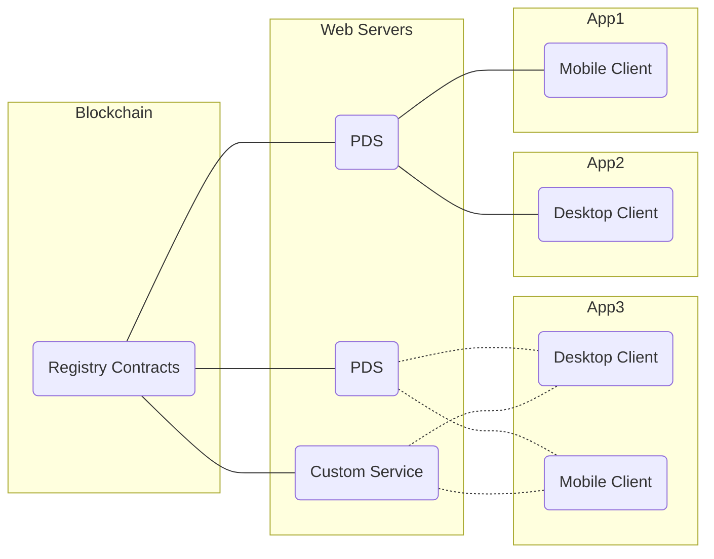

# Nosh, a Protocol for Decentralized Commerce

## Abstract
Web2 marketplaces tend to be [rent-seeking](https://en.wikipedia.org/wiki/Rent-seeking), charging asymmetric fees relative to the value of the services they provide. These networks create negative externalities on society, reduce economic efficiency, prevent emerging markets, and fail to adequately fill incentive gaps in markets. 

We develop structures for a [self-authenticating](https://en.wiktionary.org/wiki/self-authenticating) protocol specification; a new communication standard, set of rules, and technical specifications for building open e-commerce networks. 

Our design supports an interoperable network of independently hosted `Provider Supporting Nodes` and `Buyer Supporting Nodes` - generically referred to as a `Personal Data Stores (PDS)` - that are responsible for onboarding participants on either side of a market, storing their data, and relaying transaction `intents` to a range of open services in the network.

Our design grants users the ability to "switch" between managed-hosts (PDS), shifting control to individuals within the network. This simple design modification ensures that the rent that any infrastructure provider might charge to an account in the network will fall to it's market clearing price. As such, most of the value created by the network will accrue to the edges, maximally benefiting the networks participants as the network matures.

*Our design optimizes for:*
- **Scale**: Our Authenticated [Data Model](./00004-data-models.md#proposal) can prove its own "validity" without an external validator through simple crytographic signing methods. Such properties are important when sharing data with untrusted parties in distributed systems.
- **Extensibility**: The [Nosh Schema Definition Language (NSDL)](./00005-schema-definition-language.md) provides a standardized and extensible way to define new data structures, record types, and API methods as the network grows into new markets and use cases.
- **User Choice and Portability**: if any `Personal Data Store` fails to maintain it's service, begins charging high fees, or has performance failures, users are free to switch to a new managed host (Personal Data Store) without requiring permission from the original host.
- **Interoperability**: The [Nosh Schema Definition Language (NSDL)](./00005-schema-definition-language.md) and [Node Registry](./00002-node-registry.md) promotes interoperability between different nodes, services, and applications.
- **Self-Sovereign Identity**: The design introduces a [self-sovereign identity](./00003-identity-contracts.md) framework that gives users control over their identities and data within the network.
- **Developer Experience**: The [Nosh Schema Definition Language (NSDL)](./00005-schema-definition-language.md) and [Nosh Remote Procedure Calls](./00010-remote-procedure-calls.md) aim to provide a robust developer experience with tooling like code generation, runtime validation, and strong type guarantees without sacrificing interoparability with other peers.
- **Token Economies**: Individual users (`Buyers` and `Providers`) and services all have globally unique identites on the blockchain. The blockchain serves as both a discovery layer, and infrastructure for token based incentive mechanisms. 
- **Trust**: We introduce concepts for [authenticated](https://www.cs.umd.edu/~mwh/papers/gpads.pdf), [conflict free](https://en.wikipedia.org/wiki/Conflict-free_replicated_data_type) data structures through a signed, content-addressed, [Merkle Search Tree](./00006-data-repositories.md#mst-structure). Such structures allow us to widen the set of storage and computational possibilities to a much broader set of untrusted providers.
- **Usability**: We adopt [WebAuthN](https://www.w3.org/TR/webauthn-2/) as a universal registration and authentication standard. WebAuthN is the w3c specification underlying Passkeys. Passkeys are a significant UX improvement over traditional seed phrase management mechanisms for decentralized identity solutions. 

## Identity
In centralized networks, central servers own a users identity and, as such, their relationship to the network. As the network grows, and power accumulates to central authorities, platforms begin to extract from stakeholders - usually through increasingly high take rates in commercial settings. 

We introduce a [self-sovereign identity](https://en.wikipedia.org/wiki/Self-sovereign_identity) framework that shifts control back to the users within the network. Our identity solution aims to achieve the following:

- **ID provisioning** Users should be able to create global IDs which are stable across services. These IDs should rarely change to ensure that links to their data are stable.
- **Public key distribution** Distributed systems rely on cryptography to prove the authenticity of data and provide end-to-end privacy. The identity system must publish their public keys with strong security.
- **Key rotation** Users must be able to rotate their key material without disrupting their identity.
- **Service discovery** To interact with other users, applications must be able to discover the services in use by a given user.
- **Usability** Users should not have to remember a seed phrase or perform other cognitively demanding tasks to receive the benefits of their decentralized identity.  
- **Portability** Identities should be portable across services. Changing a provider should not cause a user to lose their identity, relationship to the network, or content.
- **Self-Custody**: Users should have full digital control of their identity and their relationship to infrastructure and services within the network.
- **EVM Compatible**: Identity primitives should be compatible with blockchains and serve as a users wallet. Users must be able to earn tokens.
- **Recoverability**: Users must be able to recover their account in the event of a lost private key.
- **Privacy-Preserving Interactions**: Ensure that users can selectively disclose relevant information while protecting sensitive data, such as address information or other personal identifiers.

Users create a global identity within the network by going through a registration procedure and interfacing with on-chain smart contracts. A users identity is a numeric identifier like `423987` controlled by a key pair, and is called the `account identifier`. 

We also introduce the concept of a `delegated signer`. Delegated signing makes it easy for a user to interact with the network and it's available services while delegating the signing process to a `client` that represents their interests. Delegated signatures allow clients to automate the signature process so the user does not have to present their private key during every stage in their transaction lifecycle. 

Users typically approve a `client` as a signer during the sign up flow in a new application. Users can unilaterally revoke signature delegation at any time.

Users include their `account identifier` and sign every [`intent`](#intent-casting). This mechanism makes all communication within the network tamper-proof and self-certifying. Recipients of `intents` validate these signed messages against the [`identity contracts`](./00003-identity-contracts.md) before processing, storing, or transmitting data.

## Personal Data Stores
We assume webservers are necessary for performing computational tasks for filtering information and providing app-views. We also assume that most users will not want to host their infrastructure, although this is entirely possible within the standard.

Each user has a PDS. A PDS is a webserver containing a content-addressed personal data repository for a user's account information. This repository represents a collection of records stored by a user and signed by the users delegated signature authority (delegated signer). Creation or updates of records are signed, canonical, live, transactable, and can be independently verified by any third party regardless of the storage location of the data.

If any `Personal Data Store` fails to maintain it's service, begins charging high fees, or has performance failures, users are free to switch to a new managed host provider (`Personal Data Store`), including to their own infrastructure. Because, 1. it is easy to switch hosts, 2. it is easy for anyone to operate a `Personal Data Stores`, `Personal Data Stores` will be able to charge *the exact rent* that their service can justify in an open market. 

A user's PDS also serves as a generic HTTP proxy between the user and other services within the network.

## Intent Casting
Users are categorized as either a `Buyer` or `Provider`. Each represents a specific *type* of user on either side of a two-sided market. User's can discover one another and engage in purchasing behavior through a basic server-to-server communication standard in a peer-to-peer network. All peers, in this context, are PDS servers that are registered and discoverable in a global, public, decentralized [registry](./00002-node-registry.md) infrastructure. 

Peers are represented as either `Buyer PDS` or `Provider PDS`, depending on whether they support the `Buyer` or `Provider` side of the market.

`Buyers` form purchase intents as signed data requests on any protocol-enabled client. The user's PDS receive requests on behalf of a user and proxies these search requests to the network. Purchase intents discover PDS servers that support `Providers` who have the capacity to fulfill the purchase intent by indexing a list of available services in the netowrk's [registry infrastructure](./00002-node-registry.md). After discovery, a `Buyer` and `Provider` peer can directly engage and commence in their transaction without the need for an intermediary. This process of discovery, as well as the subseuqent steps in a transaction, are called `intent-casting`.

## Interoperability Guarantees
An open network like nosh needs a way to agree on data structures, transport, and semantics. During inter-service network communications (like intent-casting), PDS nodes receive strong typechecks and runtime correctness guarantees by implementing the [Nosh Schema Defintion Language (NSDL)](./00005-schema-definition-language.md). The NSDL NSDL is similar to an [OpenAPI](https://en.wikipedia.org/wiki/OpenAPI_Specification) specification with added semantic nice-to-haves and opinions for ensuring interoparability among services.

The NSDL is used to define RPC methods and record types, providing developers with a standardized approach and workflow for crafting and specifying new data structures within the network. Such a standard allows protocol implementations to have strong guarantee as the network matures into new categories.

## Clients
A client is any application interface that allows a user to register and / or interface with the network and it's services. Users are then free to choose the client that best suits their needs and preferences. Clients are free to produce and distributed. Application developers have the benefit of tapping into the existing network effects of the protocol network. Developers can run their own servers to provide highly-customized experiences, or they can tap into existing infrastructure, depending on their needs.

## Getting to Permissionless
- Insurance, Arbitration, and Disputes
- Gossip, libp2p specification
- Peer scoring methods
- Indexers, Gateways
- Payments
- WebAuthN docs
- Verifiable Compute
- Decentralized micro-services architectures

## Future Work and Technical Challenges
- Privacy-preservation: Improve the design to enable privacy-preserving interactions, allowing users to selectively disclose relevant information.
- Session-based signature delegation
- 

## References