# RFC: Transaction Lifecycle APIs

- **status:** Draft
- **Author:** Michael Perhats
- **Created:** 02-24-2024
- **Last supportd:** 02-24-2024

## Abstract
This document proposes an overview of different actors who can work together to build open e-commerce networks across which `Providers` and their services are universally discoverable from any protocol-enabled application.

## Introduction
A `Buyer` or `Provider` on either side of a two-sided market can discover one another and engage in purchasing through basic server-to-server communications in a peer-to-peer network. Peers are discoverable through a global, public, decentralized [registry](./00002-node-registry.md). 

## Motivation
The building blocks for commercial markets should exist outside of private companies as public digital infrastructure, like the Internet itself. An open, decentralized protocol for commercial markets gives `Buyers` and `Providers` a choice in their experience, `Providers` control over their relationships with `Buyers`, and developers access to the pre-existing network effects of the network.

### Network Participants

#### Buyer
An individual with a need to purchase a product or service at a given moment in time. 

#### Provider 
An organization with a Catalog of products or services available for sale. 

#### Buyer Servicing Node (BSN)
`BSNs` build software applications & store Buyer data for the network. BSNs can be managed by individual developers or organizations who intend to offer experiences to consumers but do not care to maintain inventory lists of `Providers`.  

`BSNs` can be managed by individual developers or organizations who intend to offer experiences to consumers. `BSNs` might have a new idea for a new application, like a video-first shopping app, a social-commerce app, or a spatial-computing shopping experience. `BSNs` implement the protocol because it gives them instant access to a network of `Producers`. They can implement the protocol standard and get access to these `Producers` without ever having to formally onboard the `Producer` or communicate with them. 

#### Provider Servicing Node (PSN)
`PSN`s onboard the `Provider` side of the network. PSNs can be managed by a local chamber of commerce, a small business cooperative, individual restaurants or retailers, taxi-networks, big tech companies, etc. The primary role of the `PSN` in the open network is to attain and maintain fresh inventory lists for `Providers` such that when a `Buyer` broadcasts an intent to transact, they can be sure that their request to avail services/products is fulfilled by the `Provider` 

The primary role of the `PSN` is to maintain inventory lists for `Producers` so that when a `Buyer` searches for a service, the `PSN` can respond with a list of `Providers` that are capable of fulfilling the `Buyers` request. `PSNs` can charge a fee for providing tools for `Producers` that help them maintain their inventory and accept more orders. For example a `PSN` might make it easier for `Producers` to manage their inventory via a point-of-sale solution. Some `Producers` may choose to run their own `PSN` instance, although this behavior is unexpected. 

#### Personal Data Stores (PDS)
A `PSN` or `BSN` storing information and proxying requests on bahelf of `Buyers` or `Providers` within the network, occupying a record in the `Node Registry`. 

### Public Network Infrastructure

#### Gateways
`Gateways` are routing software that route search packets from `BSNs` and index services that help `BSNs` discover relevant `Providers` during a `Buyers` search process.
 
 ```mermaid
sequenceDiagram
    autonumber
    participant Gateway
    participant REGISTRY as Registry
    participant PSN1 as PSN(1)
    participant PSNn as PSN(N)

    Note over Gateway, PSNn: The Gateway is routing software that help nodes discover relevant services during discovery
    loop Gateway, Registry Interaction
    Gateway->>REGISTRY: /lookup
    REGISTRY-->>Gateway: response
    end 

    par PSN interactions
        Note over Gateway,PSN1: PSN(1) receives request
        Gateway->>+PSN1: api/search
        PSN1-->>-Gateway: ACK
        PSN1->>+Gateway: api/on_search
        Note over Gateway,PSN1: PSN(1) triggers callback w/ Provider list
        Gateway-->>-PSN1: ACK
        and
        Note over Gateway,PSNn: PSN(n) receives request
        Gateway->>+PSNn: api/search
        PSNn-->>-Gateway: ACK
        PSNn->>+Gateway: api/on_search
        Gateway-->>-PSNn: ACK
        Note over Gateway,PSNn: PSN(n) triggers callback w/ Provider list
    end
 ```

#### Registry 
A decentralized public ledger that maintains the records of `Node Operators`, their supported Industry Codes, and the geographical regions that they represent. The registry is queried for a `Providers` products or services by `Gateways` and `Buyer Servicing Nodes` during the search phase of a `Buyers` transaction lifecycle 

During the server-to-server communication node's are expected to send a signed digest of the request body using the private key that was used to register their node in the reigistry. When a server recives a new request, it verifies the signature header and message contents by looking up the public key of the signer in the registry and verifying the signature.

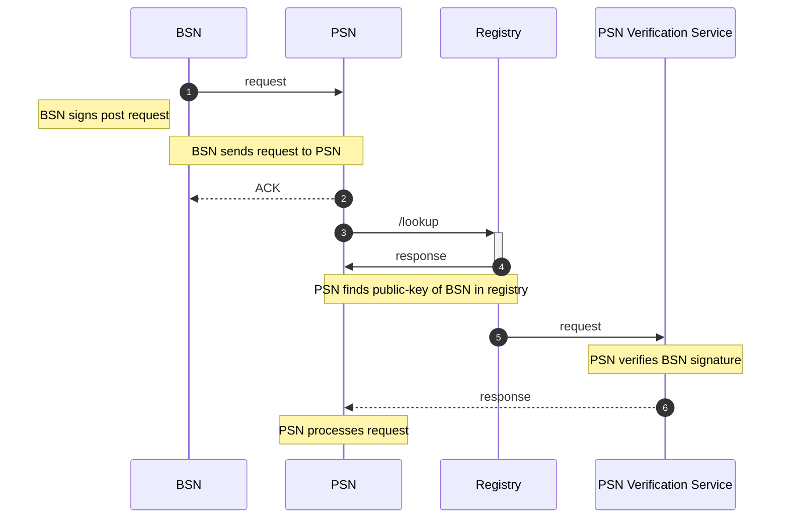

## Service Modules
Modern platforms use sophisticated services for: search and discovery, personalized recommendations, routing and logistics, fraud detection, dynamic pricing, and more. 

**Examples**:
-  a routing or logistics service could inform which drivers are returned by a `PSN` when a `Buyer` searches for a mobility or rideshare service.  
- a recommendation service could inform which `Providers` are returned by the network when a `Buyer` searches for a book written by a specific author. 

Independent parties can write `Service Modules` for various computational needs and sell them to `Node Operators`.  There should be ways for services to be discovered by `Node Operators` and used at any point during the transaction lifecycle. A network token can function as a micro-payments layer to facilitate the exchange of services. It also introduces a novel business model for publishing algorithms that provide utility for the network. This approach enables the development of a diverse range of services, enhancing the network's possibilities. 

Independent third parties should be able to list their services in a publicly discoverable registry. Their services should be computationally verifiable and self-authenticating. This could be designed similarly to [custom feeds](https://github.com/bluesky-social/feed-generator) in ATProto (Bsky).

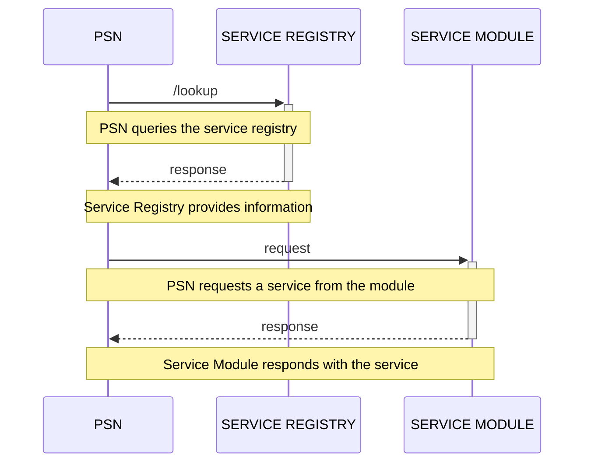
___

## Commercial Transaction Lifecycle Overview
All commercial transactions in any two-sided market can be represented by a series of interactions between a `Buyer` and a `Provider` over the life of a `Buyer`'s transaction. The network design establishes these interactions by a set of standardized APIs.

### Discovery
a `Buyer` broadcasts their intent to avail a service. The network responds with a list of `Providers`

### Shop
a `Buyer` constructs a cart from the items available in the catalogs of the `Provider` list and places an order with a `Provider`

### Fulfill
the order is fulfilled. A `Buyer` can track the status of their order.

### Post-Fulfill
a `Buyer` can review or request support for their order in the case that they are dissatisfied.

The network's core working groups and community will work on and publish standards for each API with unique schema definitions tailored to the specific service types for a variety of industries. All APIs are implemented as a series of signed, asynchronous POST requests between `Node Operators`.  

## Discovery APIs (search, on_search)

### Search, OnSearch
1. **Client Application:** Alice initiates a search for "pizza".

2. **Client Application:** Sends the search query to the `BSN`.

3. **BSN (Before API Processing):** 
   - Prepares a search packet with the query "pizza".
   - Forwards this packet to the `Gateway Provider` using the `POST /search` method, targeting the `Gateway Provider's` callback URL as registered.

4. **Gateway Provider (Broadcasting):** 
   - Receives the search query and broadcasts it to all relevant `PSN`s (Provider Servicing Nodes) that match the search criteria, ensuring a wide net is cast for Providers offering "pizza" in the appropriate geographical areas.

5. **PSN (Provider Servicing Node):** 
   - Each `PSN` processes the search query and compiles a list of Providers that meet the search criteria.
   - Responds to the `Gateway Provider` with their respective lists using the `POST /on_search` method, directed at the `Gateway Provider's` callback URL.

6. **Gateway Provider (Aggregating Responses):** 
   - Aggregates all responses from the `PSN`s into a comprehensive list of Providers.
   - Forwards this aggregated list back to the `BSN` using the `POST /on_search` method, ensuring the `BSN` receives a complete set of options to present to Alice.

7. **BSN (After API Processing):** 
   - Receives the aggregated list of Providers from the `Gateway Provider`.
   - Processes and compiles the information, preparing it for delivery to Alice's Client Application.

8. **Client Application:** 
   - Retrieves the compiled list of Providers from the `BSN`.
   - Presents the search results to Alice, allowing her to view and select from various Providers offering "pizza".


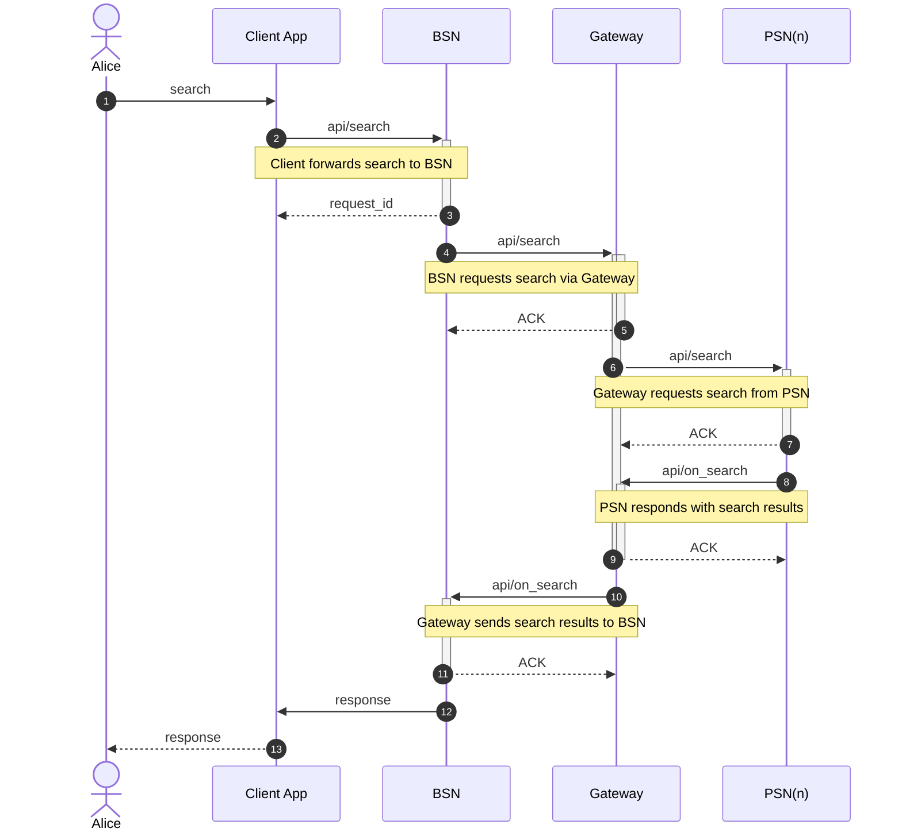

### Search, OnSearch - Specific Provider

1. **Client Application:** Alice selects a `Provider`.

2. **Client Application:** Initiates a query by sending a request to the `BSN`.

3. **BSN (Before API Processing):** 
   - Incorporates the selected `Provider` ID into a search packet.
   - Forwards this packet to the designated `PSN` using the `POST /search` method, targeting the `PSN's` callback URL as recorded in the service directory.

4. **PSN (Provider Servicing Node):** 
   - Receives the query and processes the request.
   - Responds with the `Provider`'s catalog, utilizing the `POST /on_search` method directed at the `BSN's` callback URL.

5. **BSN (After API Processing):** 
   - Captures the catalog data from the PSN.
   - Updates its records to store the catalog information, making it available for Alice's client application.

6. **BSN (Communicating to Client Application):** 
   - Sends the `Provider`'s catalog to Alice's Client Application ensuring Alice can view the available products.

7. **Client Application:** 
   - Retrieves the catalog information from the BSN.
   - Updates the user interface to display the `Provider`'s catalog to Alice, allowing her to browse the offerings.

   
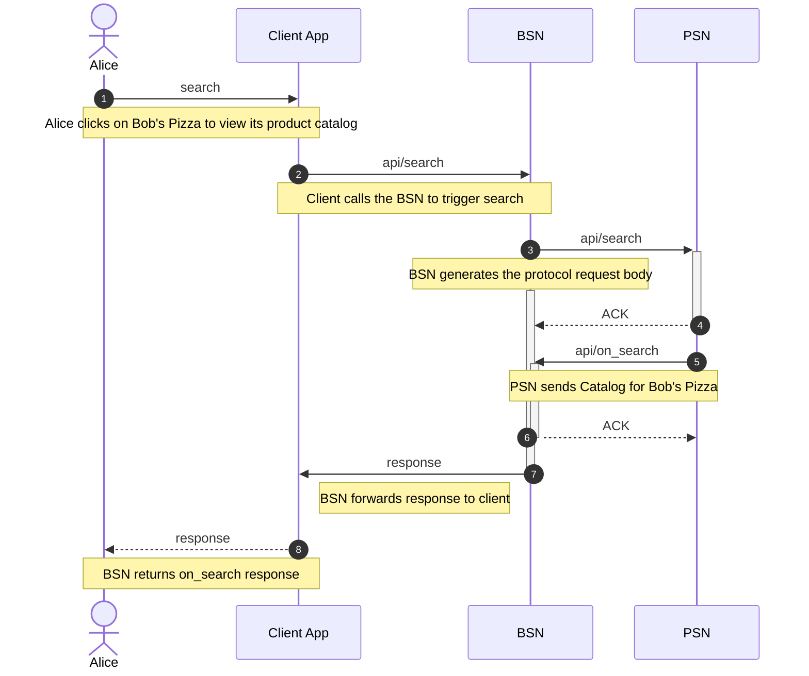

## Shop APIs (select, init, confirm, on_select, on_init, on_confirm)

### Select, OnSelect

1. **Client Application:** Alice selects items from the `Provider`.

2. **Client Application:** Initiates the selection process by sending a request to the `BSN`.

3. **BSN (Before API Processing):** 
   - Compiles the selected items into a selection packet.
   - Forwards this packet to the designated `PSN` using the `POST /select` method, targeting the `PSN's` callback URL as registered in the directory.

4. **PSN (Provider Servicing Node):** 
   - Processes the selection request.
   - Responds with a detailed cart, including itemized pricing information, through the `POST /on_select` method, addressing the `BSN's` callback URL.

5. **BSN (After API Processing):** 
   - Receives the cart and pricing details from the PSN.
   - Updates its system to store the selection and quote.

6. **BSN (Communicating to Client Application):** 
   - Transmits the selection and pricing details to Alice's Client Application, ensuring Alice can review her selections and the associated costs.

7. **Client Application:** 
   - Retrieves the selection and pricing information from the BSN.
   - Updates the interface to present Alice with her cart and the total price, allowing her to proceed to checkout or make adjustments as needed.

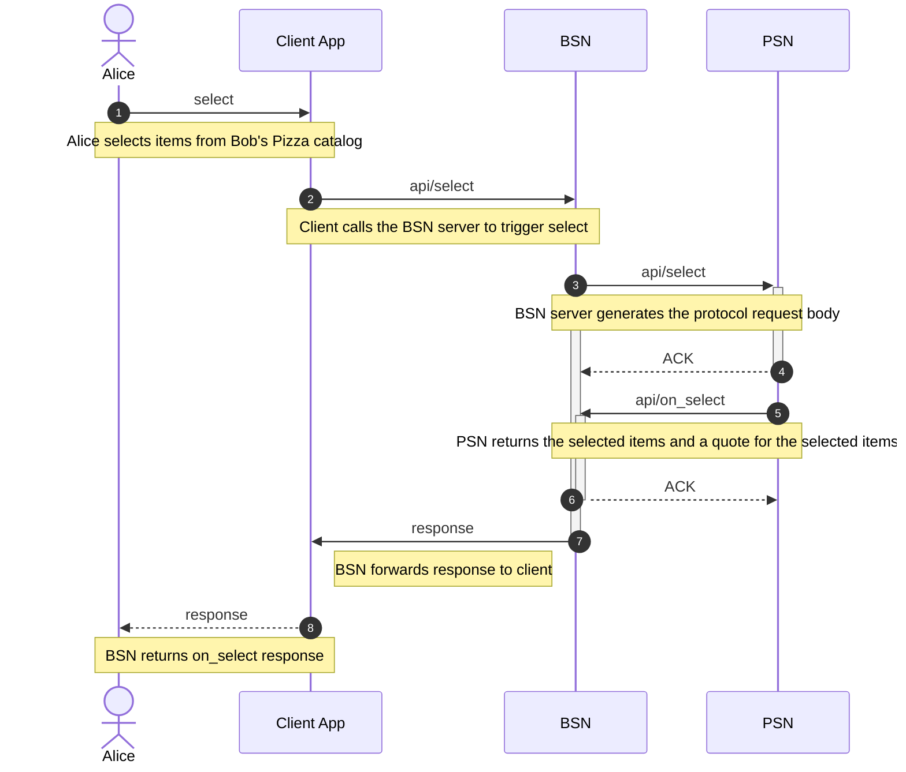

### Init, OnInit

1. **Client Application:** Alice proceeds to checkout, adding her billing and shipping details.

2. **Client Application:** Initiates the checkout process by sending a request to the `BSN`.

3. **BSN (Before API Processing):** 
   - Gathers Alice's billing and shipping details into the initialization packet.
   - Forwards this packet to the designated `PSN` using the `POST /init` method, targeting the `PSN's` callback URL as recorded in the service registry.

4. **PSN (Provider Servicing Node):** 
   - Processes the initialization request.
   - Responds with comprehensive details including the final price, payment options, refund policy, cancellation terms, and fulfillment terms, using the `POST /on_init` method directed at the `BSN's` callback URL.

5. **BSN (After API Processing):** 
   - Receives the detailed quote and terms from the `PSN`.
   - Updates its system to store the final price and terms, preparing them for retrieval by Alice's client application.

6. **BSN (Communicating to Client Application):** 
   - Transmits the detailed quote and terms to Alice's Client Application, ensuring Alice has all the information needed to proceed.

7. **Client Application:** 
   - Retrieves the response containing the final price and terms from the `BSN`.
   - Updates the interface to present Alice with the detailed quote and terms, allowing her to review and confirm her checkout decisions.

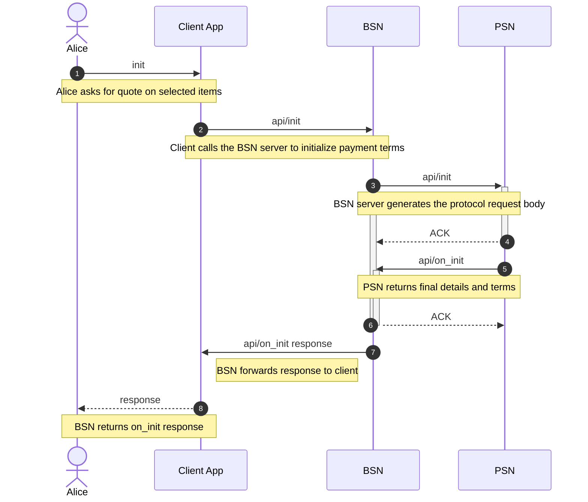

### Confirm, OnConfirm

1. **Client Application:** Alice decides to make a payment for her order.

2. **Client Application:** Initiates the payment process by sending a payment confirmation to the `BSN`.

3. **BSN (Before API Processing):** 
   - Compiles Alice's payment information into a confirmation packet.
   - Forwards this packet to the designated `PSN` using the `POST /confirm` method, targeting the `PSN's` callback URL as registered.

4. **PSN (Provider Servicing Node):** 
   - Receives the payment confirmation packet from the `BSN`.
   - Verifies the payment details and, upon successful verification, responds with the active order details using the `POST /on_confirm` method, addressing the `BSN's` callback URL.

5. **BSN (After API Processing):** 
   - Receives the confirmation of the payment and the order details from the `PSN`.
   - Updates its records with the confirmed payment status and prepares the final order details for Alice's client application.

6. **BSN (Communicating to Client Application):** 
   - Sends the confirmed order details back to Alice's Client Application, ensuring Alice receives confirmation of her payment and the status of her order.

7. **Client Application:** 
   - Retrieves the final order details and payment confirmation from the `BSN`.
   - Updates the interface to inform Alice that her payment has been successfully processed and provides her with the current details of her order.

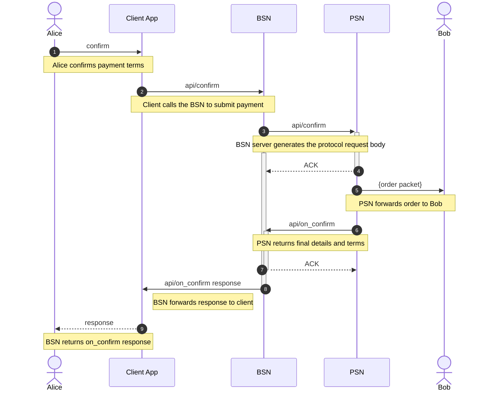

## Fulfillment APIs (status, update, cancel, on_status, on_update, on_cancel)

### Status, OnStatus

1. **Client Application:** Alice periodically checks the status of her order.

2. **Client Application:** Initiates a status check by sending a request to the `BSN` 

3. **BSN (Before API Processing):** 
   - Prepares a status inquiry by packaging the order ID in a request packet.
   - Forwards this request to the designated `PSN` utilizing the `POST /status` method, referencing the `PSN's` callback URL.

4. **PSN (Provider Servicing Node):** 
   - Receives the status inquiry from the `BSN`.
   - Processes the inquiry and responds to the `BSN` with the current order status using the `POST /on_status` method, targeting the `BSN`'s callback URL.

5. **BSN (After API Processing):** 
   - Captures the current status information from the `PSN`.
   - Updates the internal records to reflect the latest status and prepares to relay this information to Alice's client application.

6. **BSN (Communicating to Client Application):** 
   - Conveys the updated status information to Alice's Client Application.

7. **Client Application:** 
   - Receives the latest delivery status from the `BSN`.
   - Presents the updated status to Alice

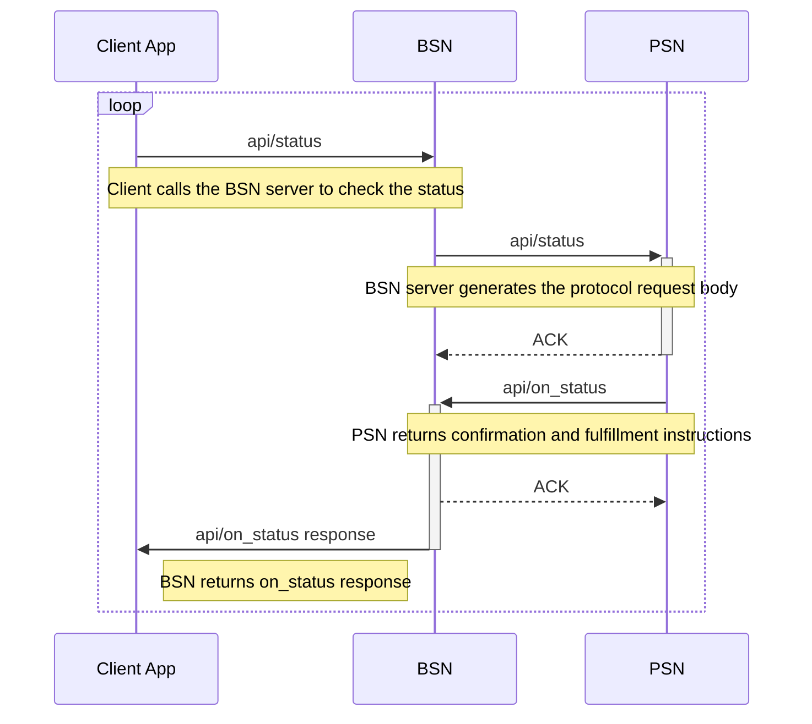

### OnStatus - triggerded by Provider

1. **Bob's App:** Bob decides to update the status of an order.

2. **Bob's App:** Initiates the status update by sending a status update packet to the `PSN`.

3. **PSN (Provider Servicing Node):** 
   - Receives the status update packet from Bob's App.
   - Processes the update and uses the `POST /on_status` API endpoint to forward the updated status information to the `BSN`.

4. **BSN (Buyer Servicing Node):** 
   - Acknowledges the receipt of the updated status information from the PSN with an ACK (Acknowledgement) response.
   - Prepares to forward the updated order status to the Client Application.

5. **BSN (Buyer Servicing Node):** 
   - Forwards the updated order status to the Client Application using a websocket connection (`ws:/status`), ensuring real-time update delivery.

6. **Client Application:** 
   - Receives the updated order status from the BSN.
   - Updates the display or status information available to the buyer, ensuring the buyer is informed of the latest order status in real-time.

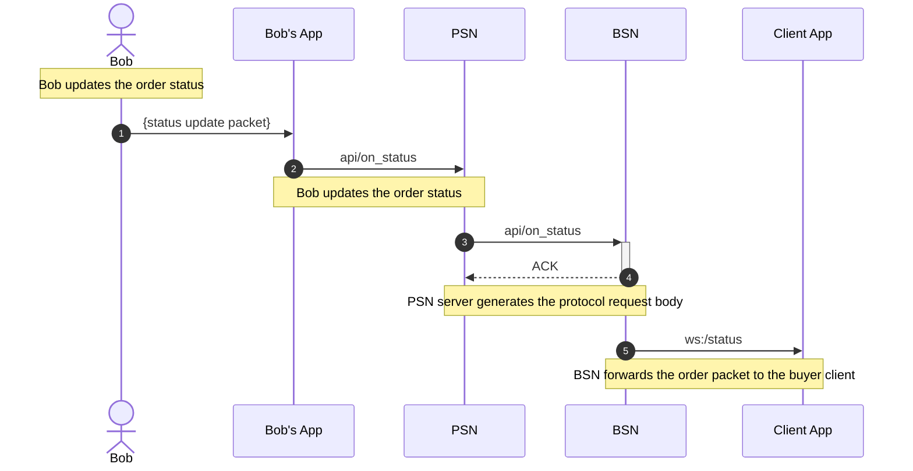


### Update, OnUpdate

1. **Client Application:** Alice requests an update to the status of her order.

2. **Client Application:** Initiates the update process by invoking the `BSN` with the `api/update` request.

3. **BSN (Before API Processing):** 
   - Prepares an update request by including the order ID in an update packet.
   - Sends this update packet to the corresponding `PSN` utilizing the `POST /update` API method, referencing the `PSN's` callback URL as registered in the system.

4. **PSN (Provider Servicing Node):** 
   - Receives the update packet from the `BSN`.
   - Processes the order update and responds back to the BSN using the `POST /on_update` method, indicating the update has been accepted and processed.

5. **BSN (After API Processing):** 
   - Receives the updated order details from the `PSN`.
   - Updates the system records with the new order status and prepares to inform Alice's client application of the change.

6. **BSN (Communicating to Client Application):** 
   - Sends the updated order details back to Alice's Client Application, ensuring Alice is promptly informed of the update to her order.

7. **Client Application:** 
   - Receives the updated order information from the `BSN`.
   - Updates the user interface to reflect the new status of Alice's order, completing the update loop and ensuring Alice is aware of the current status of her order.


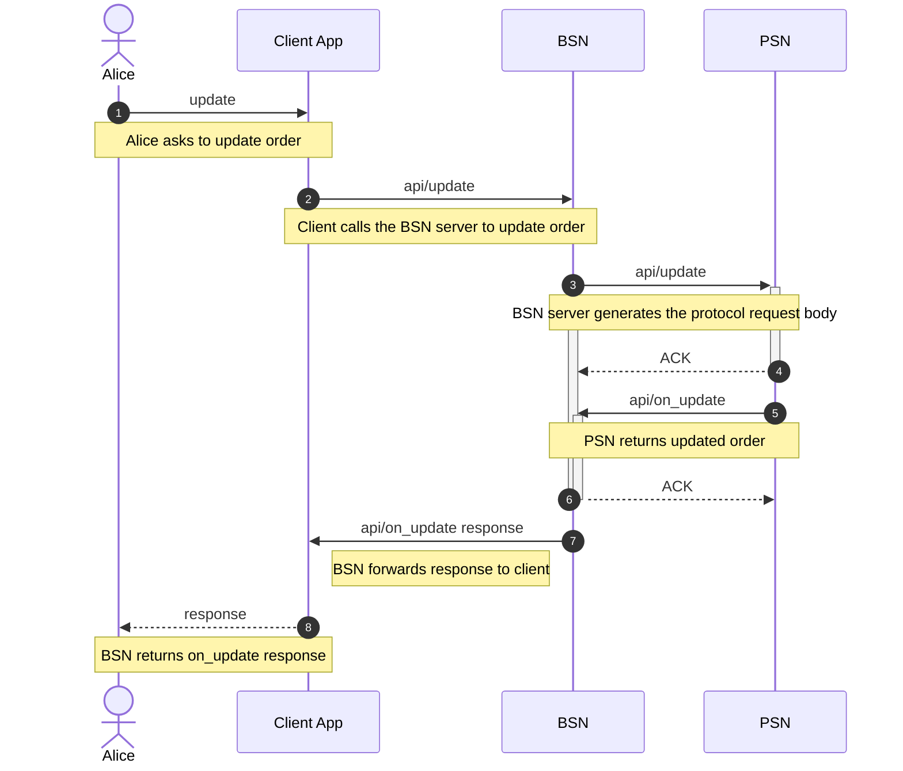

### OnUpdate - triggered by Provider

1. **Bob's App:** Bob decides to update the contents of the order.

2. **Bob's App:** Initiates the update by sending an updated order packet to the `PSN`.

3. **PSN (Provider Servicing Node):** 
   - Receives the update request from Bob's App and processes the updated order contents. 
   - Uses the `POST /on_update` method to forward the updated order packet to the `BSN`

4. **BSN (Before API Processing):** 
   - Acknowledges receipt of the updated order details from PSN with an ACK (Acknowledgement) response. 
   - Prepares to inform Alice's Client Application about the update.

5. **BSN (After API Processing):** 
   - Forwards the updated order packet to Alice's Client Application through a websocket connection using the `ws:/update` endpoint, ensuring real-time notification.

6. **Client Application:** 
   - Receives the updated order packet from `BSN`. Updates the order status or contents displayed to Alice, ensuring she is informed of the changes made by Bob.


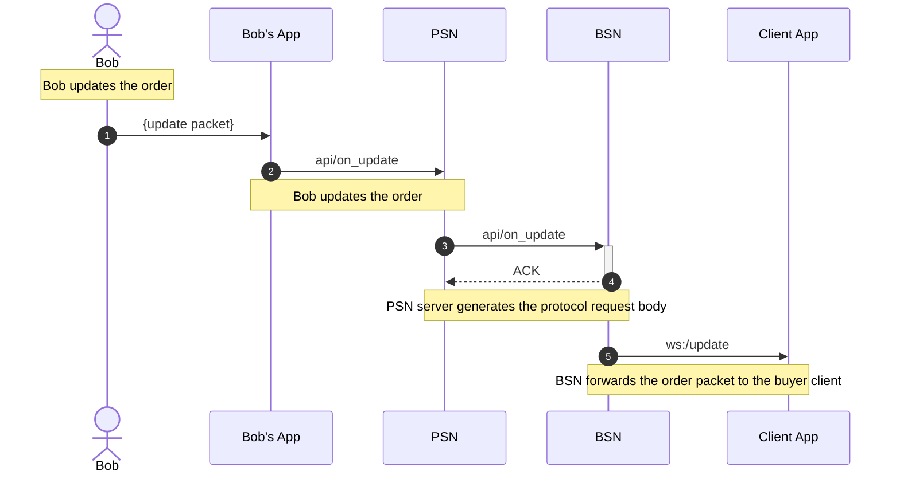

### Cancel, OnCancel

1. **Client Application:** Alice asks to cancel her order.

2. **Client Application:** Initiates the cancellation process by sending a request to the `BSN`.

3. **BSN (Before API Processing):** 
   - Prepares a cancellation request by packaging Alice's order ID and sending it to the appropriate `PSN` using the `POST /cancel` method on the `PSN's` callback URL, as found in the registry.

4. **PSN (Provider Servicing Node):** 
   - Receives the cancellation request and processes it. Confirms the cancellation by using the `POST /on_cancel` method, sending a confirmation back to the `BSN` through its callback URL.

5. **BSN (After API Processing):** 
   - Upon receiving confirmation of the cancellation from the `PSN`, the `BSN` updates its records to reflect the cancellation and prepares to notify Alice's client application.

6. **BSN (Communicating to Client Application):** 
   - Sends the cancellation confirmation to Alice's Client Application, ensuring Alice is informed of the order's cancellation status.

7. **Client Application:** 
   - Receives the cancellation confirmation from the `BSN`.
   - Updates the UI to inform Alice that her order has been successfully canceled, closing the loop on the cancellation request.


### OnCancel - triggered by Provider

1. **Bob's App:** Bob decides to cancel the order.

2. **Bob's App:** Initiates the cancellation by sending a cancellation request to the `PSN`.

3. **PSN (Provider Servicing Node):** 
   - Receives the cancellation request from Bob's App and processes the request.
   - Uses the `POST /on_cancel` method to forward the cancellation request to the `BSN`, indicating the desire to cancel the order.

4. **BSN (Before API Processing):** 
   - Acknowledges receipt of the cancellation request from PSN with an ACK (Acknowledgement) response.
   - Prepares to inform Alice's Client Application about the cancellation.

5. **BSN (After API Processing):** 
   - Forwards the cancellation confirmation to Alice's Client Application through a websocket connection using the `ws:/cancel` endpoint, ensuring real-time notification.

6. **Client Application:** 
   - Receives the cancellation confirmation from `BSN`.
   - Updates the order status to reflect the cancellation to Alice, ensuring she is informed of the cancellation made by Bob.

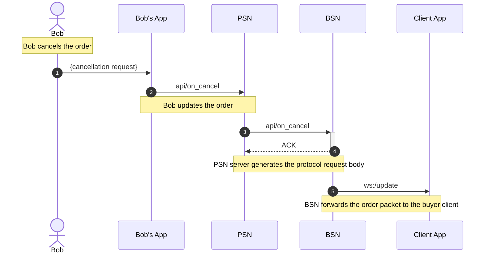


## Post-Fulfillment APIs (support, on_support)

### Support, OnSupport

1. **Alice's Client Application:** Alice identifies an issue with her order and decides to request support.

2. **Alice's Client Application:** Initiates the support request by sending a support query to the `BSN`.

3. **BSN (Buyer Servicing Node):** 
   - Receives Alice's request for support and processes it.
   - Sends a `POST /support` request to the `PSN`, including details of Alice's order and the specific support requested.

4. **PSN (Provider Servicing Node):** 
   - Acknowledges the receipt of the support request from the BSN with an ACK (Acknowledgement) response.
   - Assesses the request and compiles the necessary support details.

5. **PSN (Provider Servicing Node):** 
   - Sends the compiled support details back to the BSN using the `POST /on_support` method.

6. **BSN (Buyer Servicing Node):** 
   - Receives the support details from the PSN and prepares the information for Alice's Client Application.

7. **BSN (Buyer Servicing Node):** 
   - Forwards the detailed support response to Alice's Client Application using the `api/on_support` response endpoint.

8. **Alice's Client Application:** 
   - Receives the support response from the BSN.
   - Updates the interface to present the support information to Alice, ensuring she receives the help requested for her order.

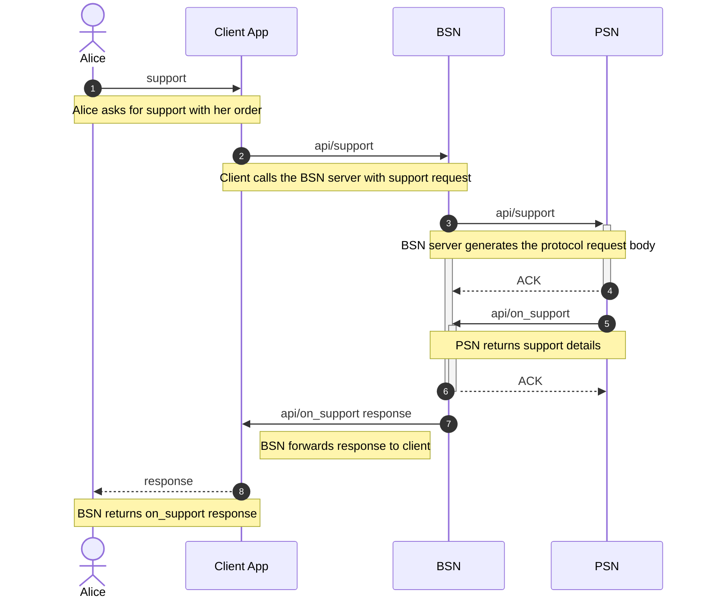


## References


