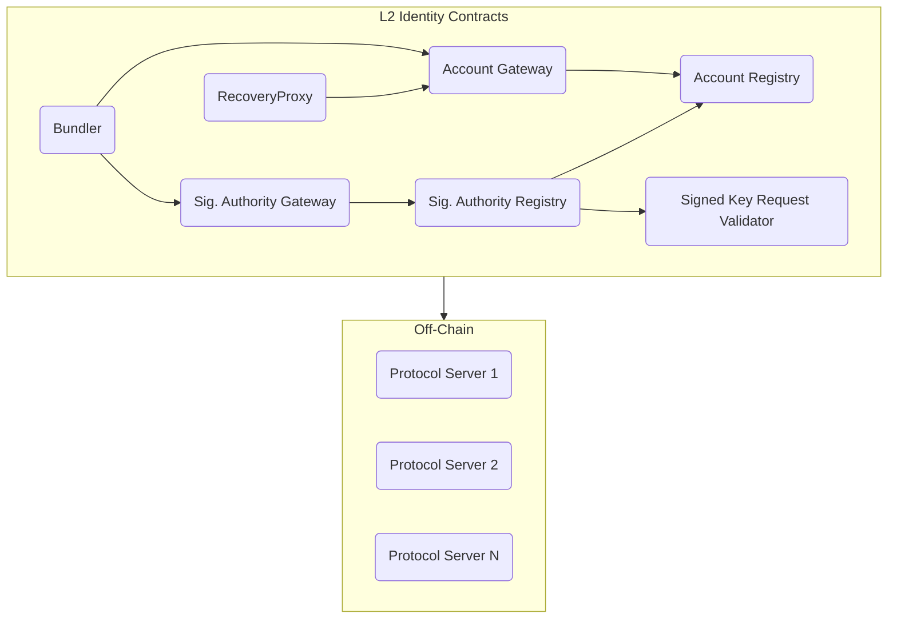
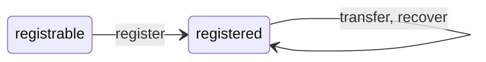
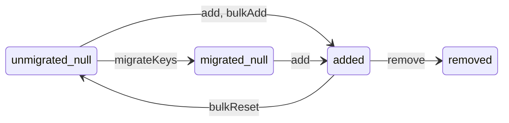

# RFC: A Self-Sovereign Identity proposal in p2p Commercial Networks

- **status:** Draft
- **Author:** Michael Perhats
- **Created:** 03-30-2024
- **Last supportd:** 03-30-2024

## Abstract
This RFC proposes a self-sovereign identity framework for decentralized commercial networks and identity primitives for a distributed network of users on either side of a two-sided commercial transaction. 

## Motivation
The motiviation for a decentralized identity standard is to shift control back to the users within the network.

## Introduction
The proposed solution aims to achieve the following:

- **ID provisioning** Users should be able to create global IDs which are stable across services. These IDs should rarely change to ensure that links to their data are stable.
- **Public key distribution** Distributed systems rely on cryptography to prove the authenticity of data and provide end-to-end privacy. The identity system must publish their public keys with strong security.
- **Key rotation** Users must be able to rotate their key material without disrupting their identity.
- **Service discovery** To interact with other users, applications must be able to discover the services in use by a given user.
- **Usability** Users should not have to remember a seed phrase or perform other cognitively demanding tasks to receive the benefits of their decentralized identity.  
- **Portability** Identities should be portable across services. Changing a provider should not cause a user to lose their identity, social graph, or content.
- **Self-Custody**: Users should have full digital control of their identity and their relationship to infrastructure and services within the network.
- **EVM Compatible**: Identity primitives should be compatible with EVM's and server as a users wallet. Users must be able to earn blockchain tokens
- **Privacy-Preserving Interactions**: Ensure that users can selectively disclose relevant information while protecting sensitive data, such as addresses or personal identifiers

## Account Contracts
Users create a global identity within the network by going through a registration procedure and interfacing with on-chain smart contracts. This document defines the set of contracts that help a user bootstrap their identity and their delegated signers. Delegated signatures allow users to easily interact with the network and it's avilable services while delegating the signing process to a client that represents their interests. Delegated signatures allow clients to automate the signature process so the user does not have to present their private key during every stage in the transaction lifecycle; optimizing for usability.

**General Patterns**
 You will notice that the identity contracts are broken into *Gateway* and *Registry* patterns. Gateway contracts are used exclusively as entry points into each of the identity management systems. Registry contracts are typically used to maintain existing records.

**The networks identity infrastructure includes the following on-chain and off-chain elements:**
- Account Registry
- Account Gateway
- Signature Authority Registry
- Signature Authority Gateway
- Validators
- Bundler
- Recovery Proxy
- Personal Data Stores

### Account Identifiers
The `account identifier` is a globally unique, canonical identifier for the holder of a `custody address` that has registered in the `Account Registry`

### Account Registry
The Account Registry generates an autoincrementing nonce that represents an individual accounts unique `account identifier`. The contract increments a global integer value and assigns this integer as a unique, global, and canonical value for the holder of an `custody address`. The relationship between the `account identifier` and an `custody address` is 1:1. The `custody address` that registers a new `account identifier` is known as the `custody address`. A single `custody address` can only ever own a single `account identifier`. The holder of the `custody address` may elect a single `recovery address` that can transfer the `account identifier` to a new `custody address`. The registering `custody address` has unilateral authority to modify or remove the `recovery address` at will. Under no circumstances can any third party modify or remove the `recovery address` on behalf of the owner.

**Canonical Constants**
- A single custody address can only own a single `account identifier`
- A single `account identifier` can only ever be owned by a single `custody address`
- `account identifier`s are autoincrementing, non-repeating, and sequential. 
- Each `custody address` can only ever have a single `recovery address` 

**Administration**
The `custody address` has unilateral authority to pause and unpause the contract, which prevents all methods (registration, transfer, and recovery) from executing. 

### Account Gateway
The Account Gateway registers new Account IDs and adds them to the `Account Registry`.

While the `Account Registry` defines the rules of `account identifier` ownership, transfers, and recovery, the `Account Gateway` is responsible for the the actual registration logic. 

**Canonical Constants**
- registrants must rent 1 storage unit at registration time.
- The contract can only transition to untrusted mode once, and never back to trusted mode.

**Administration**
The `custody address` has unilateral authority to pause and unpause the contract, which prevents all methods (registration, transfer, and recovery) from executing. 

**Account Gateway State Machine**
An `account identifier` can exist in two states:

registrable - the `account identifier` has never been issued
registered - the `account identifier` has been issued to a `custody address`

The `account identifier` state transitions whe specific methods are invoked:

register() - register a new `account identifier` from any address
transfer() - move an `account identifier` to a new custody address
recover() - recover (move) an `account identifier` to a new custody address

#### Methods

### Signature Authority Registry
The `Signature Authority Registry` contract lets addresses with an `account identifier` register or remove public keys to sign on their behalf in the network. This delegated signature pattern is useful to avoid the requirement of accounts presenting their private key for every `message` created during their checkout experience. The `Signature Authority Registry` allows for temporary or permanent delegation of `message` signing to a `client` that represents the `account` during their transaction lifecycle.

Keys added on-chain are tracked by `Personal Data Store`s and can be used to validate a users `message`s and data. The same key can be added by different `account identifier`s (permitting a single `client` to represent many `account`s) and can exist in different states. Keys contain a key type that indicates how they should be interpreted and used when verifying signatures. During registration, metadata can also be emitted to provide additional context about the key. Keys contain a metadata type indicating how this metadata should be validated and interpreted. 

**Key Types**
The only key type today is TYPE_1 that indicates that a key is an [EdDSA](https://www.w3.org/TR/vc-di-eddsa/) key and should be allowed to sign messages on behalf of an `account identifier`.

**Metadata Types**
Key types may have multiple associated metadata types, indicating how their associated metadata should be validated and interpreted. The only metadata type today is key TYPE_1, metadata TYPE_1, for "signed key request" metadata.

**Canonical Constants**
- *Addition*: A key can move to the added state if and only if its current state is the null state.
- *Valid* metadata: A key can move to the added state if and only if its metadata passes validation.
- *Removal*: A key can move to the removed state if and only if it was previously in the added state.
- *Reset*: A key can move to the null state if and only if it was previously in the added state, the contract hasn't been migrated, and the action was performed by the owner.
- *Events*: Event constants are specified in comments above each event.
- *Limits*: A new key may only be added if its addition would not exceed the keys per `account identifier` limit.

### State Machine
A key can exist in four states for each `account identifier`:
- `unmigrated_null` - the key has never been registered for the given `account identifier` and migration has not completed.
- `migrated_null` - the key has never been registered for the given `account identifier` and migration has completed.
- `added` - the key has been registered for a given `account identifier`.
- `removed` - the key has been registered and then removed for a given `account identifier`.

A key will undergo a state transition when `account identifier`s take specific actions on the keys they *own*:
- `add` - move a key from `migrated_null` to `added` for an `account identifier`.
- `remove` - move a key from `added` to `removed` for an `account identifier`.

A key will undergo a state transition by the following actions that are only possible before a migration:
- `migrateKeys` - move all keys from unmigrated_null to migrated_null.
- `bulkAdd` - move keys from unmigrated_null to added for given `account identifier`s.
- `bulkReset` - move keys from added to unmigrated_null for given `account identifier`s.

### Signature Authority Gateway
The `Signature Authority Gateway` is the user-facing contract responsible for adding new keys to the `Signature Authority Registry`. While `Account Registry` defines the rules of key addition and deletion, the `Signature Authority Gateway` is responsible for the the actual addition logic.

**Canonical Constants**
- Supports the addition of a key to the registry

### Validator
Validators implement a simple signature validation scheme to verify signatures during registration. The `Signature Authority Registry` uses the Validator contract to discover the key type and metadata type associated with the registering key-pair in order to validate the format and metadata in the registration request.

#### Supported Validators
The `Signed Key Request Validator` provides a system component that ensures the integrity and authenticity of requests to add EdDSA public keys to the `Signature Authority Registry`. 

### Bundler
The Bundler contract lets a caller register an `account identifier`, and register a delegated signer in the `Signature Authority Registry` in a single transaction to save gas. 

### Recovery Proxy
The `Recovery Proxy` is an immutable proxy contract that allows the recovery execution logic to change without changing the `recovery address` associated with an `account identifier`. A `client` or `recovery service operator` can deploy a `recovery proxy` and use it as the `recovery address` on behalf of `account identifiers`. For example, it is suggested that clients on the network use a recovery proxy owned by a 2/3 (or other reasonable majority) multisig as the default `recovery address` for new accounts.

**Administration** 
A `recovery proxy` can change its owner, and may be owned by an EOA, multisig, or other smart contract. The owner of the `recovery proxy` can change the configured `Account Registry` address.

__ 

## Node Registry
We make the simplifying assumption that, in order to make the network economical, traditional webservers will be required to perform basic computational and routing tasks for the network such as: providing app views, verifying `messages`, routing transactions, and indexing the network's participants.

`Personal Data Stores` are webservers that store data on behalf of `account identifiers`, track the `Account Registry` to know the `custody addresses` that relate to an `account identifier`, and the `Signature Authority Registry` to find out which key pairs can sign `messages` on behalf of an account.

`Buyer Supporting Nodes` interface with `Provider Supporting Nodes` during a `Buyers` transaction lifecycle. These interactions are transport layer agnostic, POST-only,signed, server to server requests. 

An RFC for the `Node Registry` contracts can be found [here](00002-node-registry.md) 

___

## Overview Of Contract Methods
TODO: add methods.

### WebAuthN and Elliptical Curve Translations
- [eip-7212](https://eips.ethereum.org/EIPS/eip-7212)
- coinbase smart wallet github

## Additional Context

#### EdDSA Signature Reasoning:
> 1. EdDSA provides high performance on a variety of platforms
> 2. The use of a unique random number for each signature is not required
> 3. It is more resilient to side-channel attacks
> 4. EdDSA uses small public keys (32 or 57 bytes) and signatures (64 or 114 bytes) for Ed25519 and Ed448, respectively
> 5. The formulas are "complete", i.e., they are valid for all points on the curve, with no exceptions. This obviates the need for EdDSA to perform expensive point validation on untrusted public values; and
> 6. EdDSA provides collision resilience, meaning that hash-function collisions do not break this system.

## References
- [W3C Web Authentication (WebAuthn) Specification](https://www.w3.org/TR/webauthn/)
- [Decentralized Identifiers (DIDs) v1.0](https://www.w3.org/TR/did-core/)
- [Verifiable Credentials Data Model 1.0](https://www.w3.org/TR/vc-data-model/)
- [Content-Addressable Storage](https://en.wikipedia.org/wiki/Content-addressable_storage)
- [Solid MIT Project](https://solidproject.org/)
- [Zero-Knowledge Proofs](https://en.wikipedia.org/wiki/Zero-knowledge_proof)
- [User-Controlled Capabilities (UCAN)](https://ucan.xyz/)
- [Coinbase Smart Wallet](https://git`Personal Data Store`.com/coinbase/smart-wallet?tab=readme-ov-file)
- [Farcaster Protocol Specification](https://git`Personal Data Store`.com/farcasterxyz/protocol)
- [messagecasting](https://customercommons.org/category/messagecasting/)