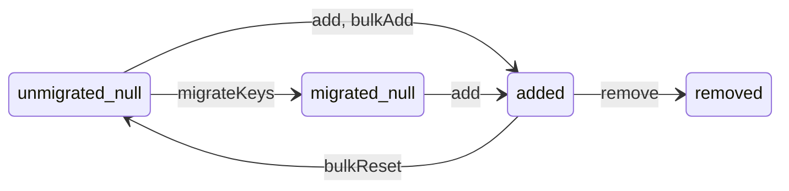

# RFC: Self-Sovereign Identity Proposal in p2p Commercial Networks

- **status:** Draft
- **Author:** Michael Perhats
- **Created:** 03-30-2024
- **Last supportd:** 03-30-2024

## Abstract
This RFC proposes a self-sovereign identity and data portability framework for decentralized commercial networks using WebAuthn, personal data repositories, and global decentralized identities for a distributed network of agents on either side of a two-sided commercial transaction. 

## Introduction
In centralized networks, central servers own a users identity and, as such, their relationship to the network. As the network grows, and power accumulates to central authorities, platforms begin to extract from stakeholders - usually through increasingly high take rates in commercial settings.

To prevent such undesirable dynamics, we develop structures for a [self-authenticating](https://en.wiktionary.org/wiki/self-authenticating) protocol. Our design grants users the ability to "switch" between managed-hosts (nodes), grant permissions to nodes, and revoke authorizations from nodes, shifting control to individual agents within the network. Therefore, the rent that any infrastructure provider might charge to an agent in the network will fall to it's market clearing price. As such, most of the value created by the network will accrue to the edges, maximally benefiting the networks participants as the network matures.

[Our design](./00001-lifecycle-apis.md) supports an interoperable network of independently hosted `Provider Supporting Nodes` and `Buyer Supporting Nodes` that are responsible for onboarding participants on either side of the network, storing their data, and relaying transaction intents to other nodes in the network. We are not strictly a p2p network; we assume webservers are necessary for performing computational tasks for filtering information and providing app views. We also assume that most users will not want to host their infrastructure, although this is entirely possible within the standard.

## Motivation
The proposed solution aims to achieve the following:

- **ID provisioning** Users should be able to create global IDs which are stable across services. These IDs should rarely change to ensure that links to their data are stable.
- **Public key distribution** Distributed systems rely on cryptography to prove the authenticity of data and provide end-to-end privacy. The identity system must publish their public keys with strong security.
- **Key rotation** Users must be able to rotate their key material without disrupting their identity.
- **Service discovery** To interact with other users, applications must be able to discover the services in use by a given user.
- **Usability** Users should not have to remember a seed phrase or perform other cognitively demanding tasks to receive the benefits of their decentralized identity.  
- **Portability** Identities should be portable across services. Changing a provider should not cause a user to lose their identity, social graph, or content.
- **Self-Custody**: Users should have full digital control of their identity and their relationship to infrastructure and services within the network.
- **EVM Compatible**: Identity primitives should be compatible with EVM's and server as a users wallet. Users must be able to earn blockchain tokens
- **Privacy-Preserving Interactions**: Ensure that users can selectively disclose relevant information while protecting sensitive data, such as addresses or personal identifiers

## Agent Contracts
Users create a global identity within the network by going through a registration procedure and interfacing with on-chain smart contracts. This document defines the set of contracts that help a user bootstrap their identity key pairs, and delegated signing patterns. Delegated signatures allow users to easily interact with the network and it's avilable services while delegating the signing process to a client that represents their interests. Delegated signatures allow clients to automate the signature process so the user does not have to present their private key during every stage in the transaction lifecycle; optimizing for usability.

**General Patterns**
 You will notice that the identity contracts are broken into *Gateway* and *Registry* patterns. Gateway contracts are used exclusively as entry points into each of the identity management systems. Registry contracts are typically used to maintain existing records.

**The networks identity and security infrastructure includes the following on-chain and off-chain elements:**
- Agent Registry
- Agent Gateway

- Node Operator Registry
- Node Operator Gateway

- Signature Authority Registry
- Signature Authority Gateway

- Validators
- Bundler
- Recovery Proxy

- Node Operators / Protocol Servers

### Agent Registry
The Agent Registry generates an autoincrementing nonce that represents an individual agents unique `agent identifier`. The contract increments a global integer value and assigns this integer as a unique, global, and canonical value for the holder of an ethereum address. The relationship between the `agent identifier` and an ethereum address is 1:1. The ethereum address that registers a new `agent identifier` is known as the `custody address`. A single `custody address` can only ever own a single `agent identifier`. The holder of the `custody address` may elect a single `recovery address` that can transfer the `agent identifier` to a new `custody address`. The registering `custody address` has unilateral authority to modify or remove the `recovery address` at will. Under no circumstances can any third party modify or remove the `recovery address` on behalf of the owner.

**Canonical Constants**
- A single custody address can only own a single `agent identifier`
- A single `agent identifier` can only ever be owned by a single `custody address`
- `agent identifier`s are autoincrementing, non-repeating, and sequential. 
- Each `custody address` can only ever have a single `recovery address` 

**Administration**
The `custody address` has unilateral authority to pause and unpause the contract, which prevents all methods (registration, transfer, and recovery) from executing. 

#### Methods

### Agent Gateway
The Agent Gateway registers new Agent IDs and adds them to the `Agent Registry`.

While the `Agent Registry` defines the rules of `agent identifier` ownership, transfers, and recovery, the `Agent Gateway` is responsible for the the actual registration logic. 

**Canonical Constants**
- registrants must rent 1 storage unit at registration time.
- The contract can only transition to untrusted mode once, and never back to trusted mode.

**Administration**
The `custody address` has unilateral authority to pause and unpause the contract, which prevents all methods (registration, transfer, and recovery) from executing. 

**Agent Gateway State Machine**
An `agent identifier` can exist in two states:

registrable - the `agent identifier` has never been issued
registered - the `agent identifier` has been issued to a `custody address`

The `agent identifier` state transitions whe specific methods are invoked:

register() - register a new `agent identifier` from any address
transfer() - move an `agent identifier` to a new custody address
recover() - recover (move) an `agent identifier` to a new custody address

#### Methods

### Signature Authority Registry
The `Signature Authority Registry` contract lets addresses with an `agent identifier` register or remove public keys to sign on their behalf in the network. This delegated signature pattern is useful to avoid the requirement of agents presenting their private key for every `intent` created during their checkout experience. The `Signature Authority Registry` allows for temporary or permanent delegation of intent signing to a `client` that represents the `agent` during their transaction lifecycle.

Keys added on-chain are tracked by `Node Operator`s and can be used to validate a users `intent`s and data. The same key can be added by different `agent identifier`s (permitting a single `client` to represent many `agent`s) and can exist in different states. Keys contain a key type that indicates how they should be interpreted and used when verifying signatures. During registration, metadata can also be emitted to provide additional context about the key. Keys contain a metadata type indicating how this metadata should be validated and interpreted. 

**Key Types**
The only key type today is TYPE_1 that indicates that a key is an [EdDSA](https://www.w3.org/TR/vc-di-eddsa/) key and should be allowed to sign messages on behalf of an `agent identifier`.

**Metadata Types**
Key types may have multiple associated metadata types, indicating how their associated metadata should be validated and interpreted. The only metadata type today is key TYPE_1, metadata TYPE_1, for "signed key request" metadata.

**Canonical Constants**
- *Addition*: A key can move to the added state if and only if its current state is the null state.
- *Valid* metadata: A key can move to the added state if and only if its metadata passes validation.
- *Removal*: A key can move to the removed state if and only if it was previously in the added state.
- *Reset*: A key can move to the null state if and only if it was previously in the added state, the contract hasn't been migrated, and the action was performed by the owner.
- *Events*: Event constants are specified in comments above each event.
- *Limits*: A new key may only be added if its addition would not exceed the keys per `agent identifier` limit.

### State Machine
A key can exist in four states for each `agent identifier`:
- `unmigrated_null` - the key has never been registered for the given `agent identifier` and migration has not completed.
- `migrated_null` - the key has never been registered for the given `agent identifier` and migration has completed.
- `added` - the key has been registered for a given `agent identifier`.
- `removed` - the key has been registered and then removed for a given `agent identifier`.

A key will undergo a state transition when `agent identifier`s take specific actions on the keys they *own*:
- `add` - move a key from `migrated_null` to `added` for an `agent identifier`.
- `remove` - move a key from `added` to `removed` for an `agent identifier`.

A key will undergo a state transition by the following actions that are only possible before a migration:
- `migrateKeys` - move all keys from unmigrated_null to migrated_null.
- `bulkAdd` - move keys from unmigrated_null to added for given `agent identifier`s.
- `bulkReset` - move keys from added to unmigrated_null for given `agent identifier`s.

### Signature Authority Gateway
The `Signature Authority Gateway` is the user-facing contract responsible for adding new keys to the `Signature Authority Registry`. While `Agent Registry` defines the rules of key addition and deletion, the `Signature Authority Gateway` is responsible for the the actual addition logic.

**Canonical Constants**
- Supports the addition of a key to the registry

### Validator
Validators implement a simple signature validation scheme to verify signatures during registration. The `Signature Authority Registry` uses the Validator contract to discover the key type and metadata type associated with the registering key-pair in order to validate the format and metadata in the registration request.

#### Supported Validators
The `Signed Key Request Validator` provides a system component that ensures the integrity and authenticity of requests to add EdDSA public keys to the `Signature Authority Registry`. 

### Bundler
The Bundler contract lets a caller register an `agent identifier`, and register a delegated signer in the `Signature Authority Registry` in a single transaction to save gas. 

### Recovery Proxy
The `Recovery Proxy` is an immutable proxy contract that allows the recovery execution logic to change without changing the `recovery address` associated with an `agent identifier`. A `client` or `recovery service operator` can deploy a `recovery proxy` and use it as the `recovery address` on behalf of `agent identifiers`. For example, it is suggested that clients on the network use a recovery proxy owned by a 2/3 (or other reasonable majority) multisig as the default `recovery address` for new accounts.

**Administration** 
A `recovery proxy` can change its owner, and may be owned by an EOA, multisig, or other smart contract. The owner of the `recovery proxy` can change the configured `Agent Registry` address.

__ 

## Node Registry
We make the simplifying assumption that, in order to make the network economical, traditional webservers will be required to perform basic computational and routing tasks for the network such as: providing app views, verifying intents, routing transaction intents, and indexing the network.

`Node Operators` are webservers that store data on behalf of `agent identifiers`, track the `Agent Registry` to know the `custody addresses` that relate to an `agent identifier`, and the `Signature Authority Registry` to find out which key pairs can sign intents on behalf of an agent.

___

### Personal Data Repositories, MST and Data Definitions

### WebAuthN and Elliptical Curve Translations
- [eip-7212](https://eips.ethereum.org/EIPS/eip-7212)
- coinbase smart wallet github

## Examples (see docs https://docs.farcaster.xyz/reference/contracts/reference/id-registry)

(Optional) If applicable, provide details about the implementation of the proposal, including any prototypes, code snippets, or reference implementations.

Side by side code snippers and typescript SDK. 

## Additional Context

#### EdDSA Signature Patterns:

Partially covered by [does TLS 1.3 use ECDSA-Sig-Value encoded signatures for Ed25519 / Ed448?](https://crypto.stackexchange.com/questions/59917/does-tls-1-3-use-ecdsa-sig-value-encoded-signatures-for-ed25519-ed448) but to add a little, [rfc8032 describes EdDSA's advantages as](https://www.rfc-editor.org/rfc/rfc8032#section-1):

> 1. EdDSA provides high performance on a variety of platforms;
> 2. The use of a unique random number for each signature is not required;
> 3. It is more resilient to side-channel attacks;
> 4. EdDSA uses small public keys (32 or 57 bytes) and signatures (64 or 114 bytes) for Ed25519 and Ed448, respectively;
> 5. The formulas are "complete", i.e., they are valid for all points on the curve, with no exceptions. This obviates the need for EdDSA to perform expensive point validation on untrusted public values; and
> 6. EdDSA provides collision resilience, meaning that hash-function collisions do not break this system.

#### ID registry Migration
The IdRegistry is deployed in a trusted state where keys may not be registered by anyone except the owner. The owner will populate the KeyRegistry with existing state by using bulk operations. Once complete, the owner will call `migrate()` to set a migration timestamp and `emit` an event. Node operators watch for the Migrated event and 24 hours after it is emitted, they cut over to this contract as the source of truth. 

Migration happens when a new contract needs to be deployed. This could happen because of a bug, etc. In such an instance, infrastructure nodes must listen for the emission event and modify their environment to point to the new contract. If node operators fail to update the reference contract, the infrastructure nodes risk relying on outdated or potentially insecure data, which could compromise the integrity of the system or network they are part of. This failure to update their references to the new contract means they will not be synchronized with the latest state, leading to inconsistencies in data validation, ID verification, or any other functionalities reliant on the IdRegistry.

#### ID registry Upgrades
The IdRegistry contract may need to be upgraded in case a bug is discovered or the logic needs to be changed. In such cases:

1. A new IdRegistry contract is deployed.
2. The current IdRegistry contract is paused.
3. The new IdRegistry is seeded with all the registered identifiers in the old contract.
4. The KeyRegistry is updated to point to the new IdRegistry.
5. A new Bundler contract is deployed, pointing to the correct contracts.

## References
- [W3C Web Authentication (WebAuthn) Specification](https://www.w3.org/TR/webauthn/)
- [Decentralized Identifiers (DIDs) v1.0](https://www.w3.org/TR/did-core/)
- [Verifiable Credentials Data Model 1.0](https://www.w3.org/TR/vc-data-model/)
- [Content-Addressable Storage](https://en.wikipedia.org/wiki/Content-addressable_storage)
- [Bluesky AT Protocol Documentation](https://blueskyweb.xyz/docs/overview)
- [Solid MIT Project](https://solidproject.org/)
- [Zero-Knowledge Proofs](https://en.wikipedia.org/wiki/Zero-knowledge_proof)
- [User-Controlled Capabilities (UCAN)](https://ucan.xyz/)
- [Data repositories](https://atproto.com/guides/data-repos)
- [Coinbase Smart Wallet](https://git`Node Operator`.com/coinbase/smart-wallet?tab=readme-ov-file)
- [Farcaster Protocol Specification](https://git`Node Operator`.com/farcasterxyz/protocol)
- [Intentcasting](https://customercommons.org/category/intentcasting/)