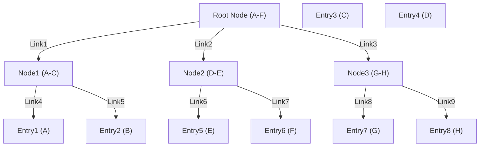

# RFC: Data Repositories

- **status:** Draft
- **Author:** Michael Perhats
- **Created:** 03-30-2024
- **Last supportd:** 03-30-2024

## Abstract
A data repo is a collection of data stored by a user and signed by a users delegated signature authority. Repositories contain self-authenticating data structures, meaning each creation or update of a piece of content is signed, canonical, live, transactable, and can be independently verified by any third party regardless of the storage location of the data.

_Please Note_: this document is a work-in-progess, we still have to write a functional implementation of the repo and this document is subject to change during this process.

## Motivation
If any `Personal Data Store` fails to maintain it's service, begins charging high fees, or has performance failures, users are free to switch to a new managed host provider (`Personal Data Store`), including to their own infrastructure. Because, 1. it is easy to switch hosts, 2. it is easy for anyone to operate a `Personal Data Stores`, `Personal Data Stores` will be able to charge *the exact rent* that their service can justify in an open market. 

## Introduction
Data repositories are essentially your own personal git repo that only you (or a [delegated signer](./00003-identity-contracts.md#signature-authority-registry)) are able to modify. Repositories are structured as [Merkle Search Tree (MST)](https://hal.inria.fr/hal-02303490/document). Every [node](https://ipld.io/docs/data-model/node/) in a repo is a [DAG-CBOR](https://ipld.io/docs/codecs/known/dag-cbor/) codec.

## Proposal
Data for `account`'s are associated **Personal Data Stores (PDS)**. An account's PDS (the home of an accounts data store) is indicated in the `Account Registry` and dictated unilaterally by an account owner by a signature from their `custody address`. 

**We propose a repo data structure with these features:**
- data structure is a [Merkle Search Tree (MST)](https://hal.inria.fr/hal-02303490/document)
- stored in binary [DAG-CBOR](https://ipld.io/docs/codecs/known/dag-cbor/)
- linked as graphs of [IPLD](https://ipld.io/docs/data-model/) objects
- content-addressed: linked by CIDs (hashes of the content)
- exported as [CAR](https://ipld.io/specs/transport/car/carv1/)
- signed commits by a [delegated signer](./00003-identity-contracts.md#signature-authority-registry) 
- support for rotatable signing keys

**Important Note**, we are working on E2EE solutions and session-based user controls to securely store private data in repos without disclosing information about addresses and other sensitive information.

## Repo Data Structure
A repo is as a key/value mapping, where the keys are represented by path names (as strings), and values are `records` stored as DAG-CBOR.

MST paths adhere to the following format `<collection>/<record-key>` where:
```text
<collection> is a normalized [RDSID](./00009-namespace-identifiers.md)
<record-key> is a valid [record key](./00007-record-keys.md)
```

**The MST path must:**
- Commence without a leading `/`.
- Consist consistently of exactly two path segments.
- Limit permitted ASCII characters within the entire path string to: letters (`A-Za-z`), digits (`0-9`), slash (`/`), period (`.`), hyphen (`-`), underscore (`_`), and tilde (`~`).
- Disallow the path segments `.` and `..` as they are deemed invalid as RDSIDs or Record Keys and are thus always disallowed in repo paths.
- paths in the same collection (normalized namespace identifiers for collections of hierarchical data) are sorted together, see [RDSID](./00009-namespace-identifiers.md). This makes enumeration and export performant.


### Commit Objects
The top-level commit (signed object) in a repo, [IPLD schema](https://ipld.io/docs/schemas/) fields:
- `aid` (integer, required): The [account identifier](./00003-identity-contracts.md#account-identifiers) associated with the repo
- `version` (integer, required): fixed value of `1` in this spec
- `data` (CID link, required): pointer to the top of the MST
- `rev` (string, TID format, required): revision of the repo, serving as a logical clock. It must increase monotonically. It is recommended to use the current timestamp as the [TID](./00007-record-keys.md#record-key-type-tid) - "future" `rev` values should not be stored
- `prev` (CID link, nullable): pointer (by hash) to a previous commit object for this repo used for backwards compatibility across repo updates. In version `1`, this field must exist but is always `null`.
- `sig` (byte array, required): signature of this commit from an account identifiers delegated signer, represented as raw bytes.

**To sign a commit:**
  - Populate all the data fields (besides `sig`)
  - Serialize the `UnsignedCommit` with [DAG-CBOR](https://ipld.io/docs/codecs/known/dag-cbor/).
  - Hash the output bytes with [SHA-256](https://en.wikipedia.org/wiki/SHA-2).
  - Sign the binary hash output (without hex encoding) using the current "private key" (signing key) for the account or the signing key of a [delegated signature authority](./00003-identity-contracts.md#signature-authority-registry) for the account.
  - Store the signature as raw bytes in a commit object, along with all the other data fields.

> Key rotations or [revoked delegation to a signature authority](./00003-identity-contracts.md#signature-authority-registry), can cause uncertainty about which public key should be used to verify signatures on older commits, potentially leading to verification issues or failure to validate the authenticity of historical data. This is an area of research for us. In future versions, we plan to improve verification methods of old commits based on global revocation timestamps emitted from the [`Signature Authority Registry`](./00003-identity-contracts.md#signature-authority-registry). 

### MST Structure
A PDS maintains repos for accounts as a [Merkle Search Tree (MST)](https://hal.inria.fr/hal-02303490/document). Node's in the tree contain key/CID mappings and links to sub-trees. 

**Node structure**
1. Entries contain (key/CID mappings)
2. Entries contain links (to other sub-trees)
3. Entries and links are organized in a key-sorted order
3. Keys of a linked sub-tree (recursively) fall in the range corresponding to the link location. 
3. When a node contains a link to another sub-tree, all keys within that linked sub-tree, as well as any sub-trees linked to it, are positioned in the tree structure in a manner that maintains the order of keys.
4. The sorting order follows a left-to-right [lexographical order](https://en.wikipedia.org/wiki/Lexicographic_order)

**represented graphically, this looks like:**


### MST Implementation
**Hash the Key:** First, the key, which is a byte array (an array of bytes, with each byte representing a character or part of binary data), is hashed using the SHA-256 algorithm. SHA-256 is a cryptographic hash function that outputs a fixed-length (256-bit) binary string. This output is referred to as the hash or the digest of the input data.

**Count Leading Zeros:** The binary output of the SHA-256 hash is then examined to count the number of leading zeros. However, instead of counting each zero individually, they are counted in 2-bit chunks. This means you look at the hash output in groups of two bits and count how many of these groups consist entirely of zeros starting from the beginning of the hash.

**Calculate Depth:** The count of leading zeros (in 2-bit chunks) is then divided by two, rounding down if necessary. The result of this division is a positive integer that represents the depth of the key within the MST.

**Fanout of 4:** The method of counting leading zeros in 2-bit chunks relates to the tree's fanout of 4. A fanout of 4 means each node in the tree can have up to four children. The depth calculated based on the leading zeros effectively places each key at a specific level in the tree, ensuring a balanced distribution of keys across the tree's depth, based on their hash values.

Some examples, with the given ASCII strings mapping to byte arrays:
```python
import hashlib
def calculate_depth_corrected(key: str) -> int:
    # Convert the key to a byte array
    key_bytes = key.encode('utf-8')
    
    # Hash the key using SHA-256
    hash_bytes = hashlib.sha256(key_bytes).digest()
    
    leading_zeros = 0
    for byte in hash_bytes:
        if byte < 64: leading_zeros += 1
        if byte < 16: leading_zeros += 1
        if byte < 4: leading_zeros += 1
        if byte == 0:
            leading_zeros += 1
            continue
        break
    
    return leading_zeros

# Test the function with the provided keys
key1 = '2653ae71'
key2 = 'nosh'
key3 = "xyz.nosh.buyer.address/s"

depth1 = calculate_depth_corrected(key1)
depth2 = calculate_depth_corrected(key2)
depth3 = calculate_depth_corrected(key3)

depth1, depth2, depth3 # outputs (0, 1, 2), representing the unique depths for each key input
```

### CID Formats
The specification for [IPFS CID](https://docs.ipfs.tech/concepts/content-addressing/#what-is-a-cid) is broad. We restrict the allowable formats to:
- CIDv1
- Multibase: binary serialization within [DAG-CBOR](https://ipld.io/docs/codecs/known/dag-cbor/) (or `base32` for JSON mappings)
- Multicodec: `dag-cbor` (0x71)
- Multihash: `sha-256` with 256 bits (0x12)

## CAR File Serialization
The standard export format for repos is: [CAR v1](https://ipld.io/specs/transport/car/carv1/), which have file suffix `.car` and mimetype `application/vnd.ipld.car`.

## References
- [Merkle Search Tree (MST) Guide Paper](https://hal.inria.fr/hal-02303490/document)
- [IPLD schema](https://ipld.io/docs/schemas/)
- [SHA-256](https://en.wikipedia.org/wiki/SHA-2)
- [IPFS CID](https://docs.ipfs.tech/concepts/content-addressing/#what-is-a-cid)
- [CAR v1](https://ipld.io/specs/transport/car/carv1/)
- [Lexographical Ordering](https://en.wikipedia.org/wiki/Lexicographic_order)
- [DAG-CBOR](https://ipld.io/docs/codecs/known/dag-cbor/)
