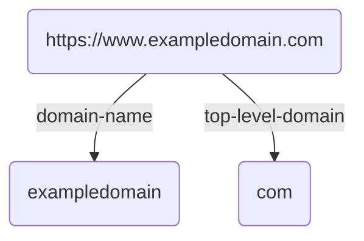

# RDSID, Reverse Domain Schema Identifiers

- **status:** Draft
- **Author:** Michael Perhats
- **Created:** 04-01-2024
- **Last supportd:** 04-01-2024

## Abstract
An RDSID (Reverse Domain Schema Identifiers) is a fully-qualified hostname in reverse domain-name order follows a specific structure to organize and identify entities within a hierarchical namespace,

## Motivation
RDSIDs give developers convenient classifications to structure [requests](./00010-remote-procedure-calls.md) and [data models](./00004-data-models.md).

## Introduction
The RDSID structure can be broken down into its component parts using the format:

```shell
{top-level-domain}.{domain-name}.{name}
```
Where:
- **{top-level-domain}**: top-level-domain, such as `com`, `org`, `xyz`, or a country code like `uk`, `us`, etc.
- **{domain-name}**: The second-level domain, which is typically the name of the organization, company, or service.
- **{name}**: the name segment used to reference a [NSDL](./00005-schema-definition-language.md) schema for records, or [NRPC](./00010-remote-procedure-calls.md) endpoints.

- **Overall RDSID Requirements**:
    - It should only include ASCII characters.
    - The domain authority and the name are to be divided by a period (`.`) in ASCII format.
    - minimum of three parts.
    - The total character count should not exceed 317.
- **Domain Authority Specifications**:
    - Individual parts must hold between 1 to 63 characters, excluding periods.
    - ASCII alphabets (`a-z`), numbers (`0-9`), and the hyphen (`-`).
    - Parts cannot commence with or conclude with a hyphen.
    - The initial part (the top-level domain) cannot begin with a number.
    - Insensitive to case variations, the domain authority ought to be uniformly presented in lowercase, converting ASCII `A-Z` to `a-z`.
    - The total length, periods included, should not surpass 253 characters, maintaining a requirement for at least two parts.
- **Name Criteria**:
    - Numbers and hyphens are prohibited.
    - case sensitive and must not be normalized.
    - The character count must range from 1 to 63.
    - Only ASCII alphabetic characters (`A-Z`, `a-z`) are allowed.

**Graphically:**


### Syntactically valid RDSIDs:
```ts
org.thing.fooBar
xyz.nosh.alice
a-0.b-1.g
x.y.z
```

### Syntactically Invalid RDSIDs:
```ts
org.exa💩ple.thing // invalid ASCII rule
org.thing // minimum of three parts validation failure
```

